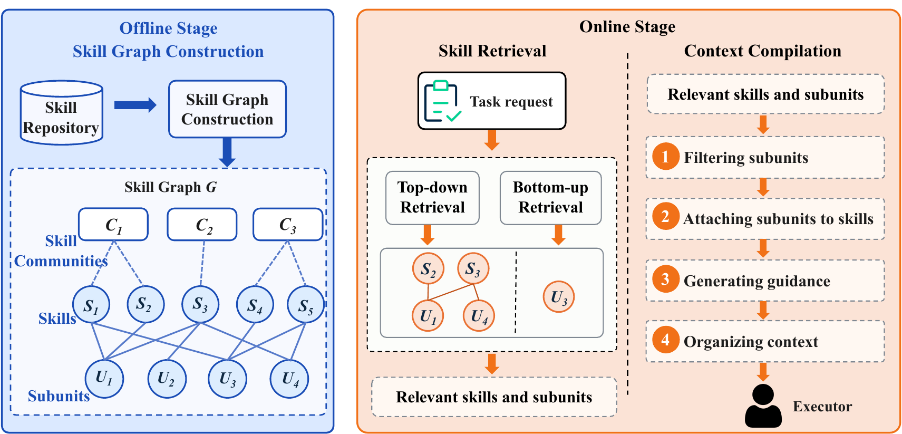
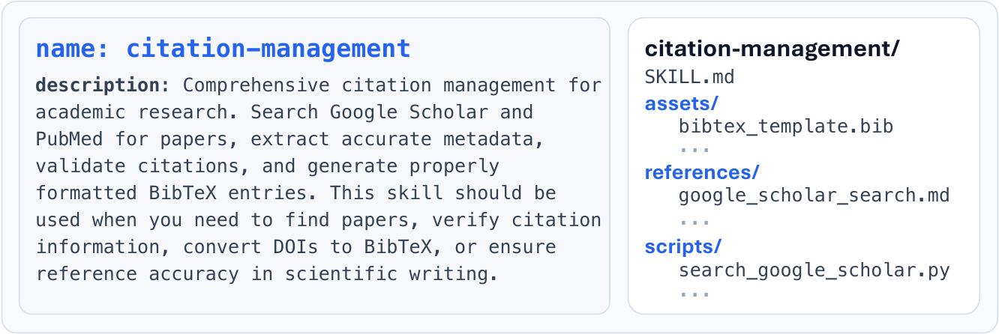

# SkillRAE Paper Code

Paper code for SkillRAE, a two-stage retrieval-augmented execution framework for agent skill-based context compilation over a multi-level skill graph.

Paper: https://arxiv.org/abs/2605.10114

This sanitized source package contains the code needed to inspect and run the paper's main method. It intentionally omits baseline implementations, local run artifacts, Git history, personal machine configuration, API credentials, and several larger derived artifacts.

## Overview



SkillRAE has two stages:

- Offline stage: build a multi-level skill graph over communities, skills, and reusable subunits.
- Online stage: retrieve relevant skills and subunits, then compile them into compact task-specific execution context.

## Example Skill



The repository includes the retrieval backend, context-compilation logic, build pipeline, and skill pool used by the paper's main method.

## Contents

- `retrieval.py`: hierarchical skill retriever over the skill graph and precomputed retrieval artifacts.
- `experiments/retrieval_tasks_backend/`: main retrieval-task backend, coordinator variants, context compilation, affiliated rescue, and summarization utilities.
- `global_skill_pool/`: skill pool used by the main method.
- `tasks/`: SkillsBench task definitions used by the backend runner.
- `skillsbench_private/`: runtime adapters used by the retrieval-task backend.
- `build_pipeline/`: scripts used to construct graph, representation, embedding, and capability-cluster artifacts.
- `edges.json`: included retrieval artifact consumed by `retrieval.py`.
- `examples/api.env.example`: placeholder-only credential template.

## What is intentionally not included

- Baseline code and baseline run outputs.
- `.git`, `.codex`, `.claude`, local editor/agent state, and machine-specific configuration.
- `runs/`, `outputs/`, `phase1_claude_runs/`, caches, bytecode, logs, and temporary experiment files.
- Real API keys or provider credentials.

## Environment

Use Python 3.12 or newer. A minimal local setup is:

```bash
python -m venv .venv
source .venv/bin/activate
python -m pip install --upgrade pip
python -m pip install -e .
python -m pip install numpy pandas scikit-learn sentence-transformers openai pyyaml
```

The full task backend also expects Docker and Harbor-compatible task execution support when running benchmark tasks end to end.

## Credentials

Do not place credentials in this repository. Export them in your shell or load them from a private file outside the repository:

```bash
export OPENAI_API_KEY=your_key_here
export ANTHROPIC_API_KEY=your_key_here
export GEMINI_API_KEY=your_key_here
```

Only set the variables required by the model/provider you run.

## Running the main method

The main method is selected through the coordinator variant used by the retrieval-task backend. A typical one-task run has the following shape:

```bash
export COORDINATOR_VARIANT=A3_refine_compact
export SKILLSBENCH_RETRIEVAL_DATA_DIR="$PWD"
export TASKS_FILE=/path/to/tasks.txt
export TASK_COUNT=1
export OUT_DIR="$PWD/runs/example_A3_refine_compact"
bash experiments/retrieval_tasks_backend/run_retrieval_tasks_backend.sh
```

`TASKS_FILE` should contain one task id per line. `OUT_DIR` should point to a writable output directory outside the submitted source package if you want to keep the package clean.

## Retrieval artifacts

`retrieval.py` expects several graph and embedding artifacts locally, but this public repository intentionally omits some larger derived files. Rebuild or supply them locally using `build_pipeline/` with the following names:

- `skill_nodes.json`
- `subunit_nodes.json`
- `edges.json`
- `canonical_skill_representations.json`
- `skill_l2_mapping.json`
- `subunit_ids.json`
- `subunit_embeddings.npy`

## Notes for reviewers

This package is focused on the paper's main method rather than comparison baselines. Baseline implementations were omitted to keep the submitted artifact minimal and to avoid mixing third-party/adaptation code with the method release.
